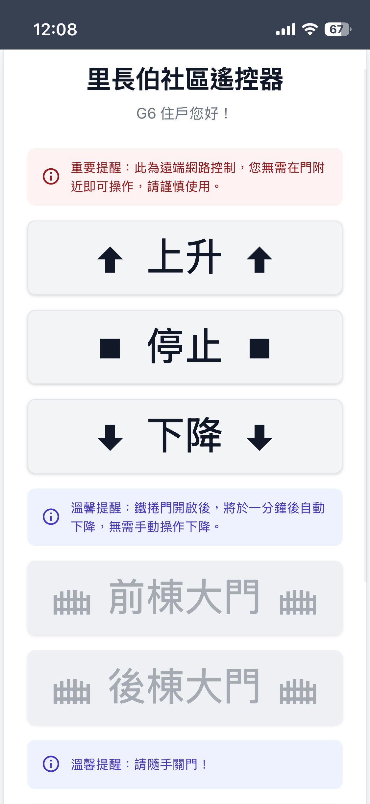
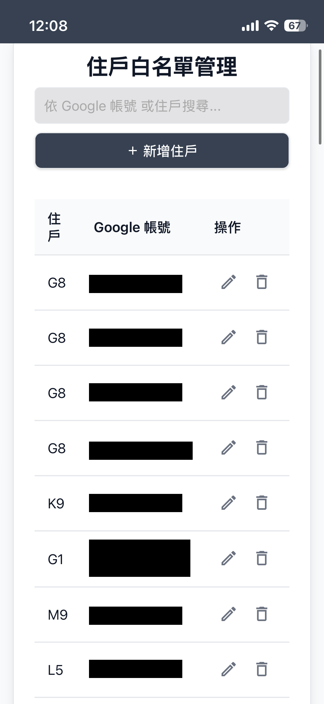
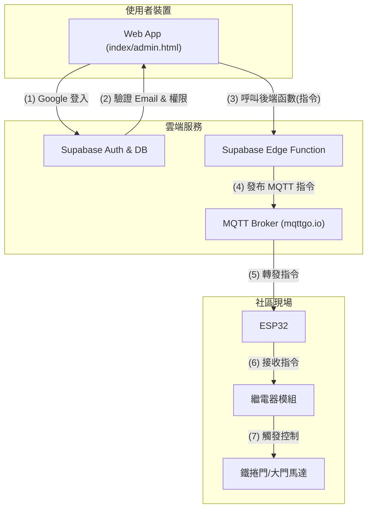

# LiChangBoGate - 里長伯社區遙控器

`LiChangBoGate` 是一個智慧社區門禁控制系統，它允許已授權的住戶透過網頁應用程式（Web App）遠端遙控社區內的多個大門與鐵捲門。

本專案結合了物聯網硬體（ESP32）、雲端後端服務（Supabase）和現代網頁技術，旨在取代傳統的實體遙控器，提供一個更安全、方便且易於管理的門禁解決方案。

### 📸 專案預覽

<table width="100%">
  <tr>
    <td width="50%" align="center"><b>使用者遙控器 (登入/操作)</b></td>
    <td width="50%" align="center"><b>管理員後台 (住戶列表/編輯)</b></td>
  </tr>
  <tr>
    <td width="50%"></td>
    <td width="50%"></td>
  </tr>
</table>

---

## ✨ 主要功能

### 使用者端
- **遠端門禁控制**: 透過手機或電腦網頁，隨時隨地控制車道鐵捲門、大門等。
- **Google 帳號登入**: 使用 Google OAuth 進行安全快速的身份驗證。
- **PWA 支援**: 可將網頁「安裝」到手機主畫面，提供類似原生 App 的體驗。
- **直覺介面**: 簡潔明瞭的按鈕與狀態提示，操作簡單。
- **跨平台**: 無需安裝特定 App，任何有瀏覽器的裝置都能使用。

### 管理員端
- **獨立管理後台**: 提供專屬的 `admin.html` 頁面進行住戶管理。
- **住戶權限管理**: 輕鬆新增、編輯、刪除住戶資料。
- **權限分級**: 可將特定使用者設定為「管理員」，共同管理系統。
- **快速搜尋**: 快速查找特定住戶的資料。

### 硬體端 (ESP32)
- **MQTT 通訊**: 透過輕量級的 MQTT 協議接收來自雲端的指令，反應快速。
- **OTA 無線更新**: 支援遠端韌體更新，無需實體接觸即可部署新功能或修復錯誤。
- **高穩定性**: ESP32 提供可靠的 Wi-Fi 連線與處理效能。

---

## 🏗️ 系統架構

本專案的運作流程如下：

1.  **使用者**: 在 `index.html` 或 `admin.html` 透過 Google 帳號登入。
2.  **前端 (JavaScript)**: 將登入資訊傳送給 Supabase 進行驗證。
3.  **前端 (JavaScript)**: 驗證成功後，使用者點擊操作按鈕，呼叫後端的 Supabase Edge Function。
4.  **後端 (Edge Function)**: 函數在後端驗證使用者身份，確認權限後，代替使用者發布 MQTT 指令到 Broker。
5.  **硬體 (ESP32)**: 持續訂閱 MQTT Broker 上的特定主題。
6.  **硬體 (ESP32)**: 收到指令後，觸發對應的 GPIO 接腳來控制繼電器。



---

## 🛠️ 技術棧

- **硬體**: ESP32
- **韌體**: C++ (Arduino Framework)
- **前端**: HTML, CSS, Vanilla JavaScript
- **後端即服務 (BaaS)**: Supabase (用於身份驗證與 PostgreSQL 資料庫)
- **通訊協定**: MQTT
- **圖示庫**: Material Design Icons

---

## 🚀 設定與部署

### 1. 硬體 (ESP32)

1.  **環境設定**:
    - 安裝 Arduino IDE 2.0.0 及以上版本。
    - 在開發環境中加入 ESP32 開發板支援，版本為 `2.0.11`。
    - 安裝必要的函式庫：`PubSubClient`、`ArduinoOTA`、`WiFi.h` 等。
2.  **修改憑證**:
    - 打開 `esp32_door_mqtt/credentials.h` 檔案。
    - 填入您的 Wi-Fi SSID、密碼、MQTT Broker 資訊以及 OTA 更新密碼。
    ```c++
    // esp32_door_mqtt/credentials.h
    const char* ssid     = "您的 Wi-Fi 名稱";
    const char* password = "您的 Wi-Fi 密碼";
    const char* ota_password = "您的 OTA 更新密碼";
    ```
3.  **上傳韌體**:
    - 將 ESP32 連接到電腦，選擇正確的 COM Port 與開發板型號。
    - 編譯並上傳 `esp32_door_mqtt/esp32_door_mqtt.ino` 程式碼。

<p align="center">
  
  <br>
  <em>硬體安裝示意圖 (ESP32 + 繼電器)</em>
</p>

### 2. 後端 (Supabase)

1.  **建立專案**: 前往 Supabase 建立一個新專案。
2.  **建立資料表**:
    - 進入 `Table Editor`，建立一個名為 `users` 的資料表。
    - 進入 `SQL Editor`，執行 `supabase/migrations/20251016142044_remote_schema.sql` 和 `supabase/migrations/20251017133144_remote_schema.sql` 的內容來建立 `whitelist` 資料表與相關權限策略。
    - 或者，手動建立一個名為 `whitelist` 的資料表，欄位如下：
        - `id` (bigint, Primary Key, is identity)
        - `created_at` (timestamptz, 預設 `now()`)
        - `email` (text, Is Unique)
        - `is_admin` (bool, 預設 `false`)
        - `resident_id` (text, 預設 `'N/A'`)
3.  **取得 API 金鑰**:
    - 前往 `Project Settings` > `API`。
    - 複製 `Project URL` 和 `anon public` 金鑰。
4.  **設定 Google 登入**:
    - 前往 `Authentication` > `Providers`，啟用 Google 並依照官方文件設定。

### 3. 前端 (Web App)

1.  **設定 Supabase 連線**:
    - 在 `script.js` 和 `admin.js` 的開頭，找到 Supabase Client 的初始化區塊。
    - 將您從 Supabase 複製的 `URL` 和 `anon` 金鑰貼上。
    ```javascript
    const { createClient } = supabase;
    const SUPABASE_URL = '您的_SUPABASE_URL';
    const SUPABASE_ANON_KEY = '您的_SUPABASE_ANON_KEY';
    const supabaseClient = createClient(SUPABASE_URL, SUPABASE_ANON_KEY);
    ```
2.  **部署網頁**:
    - 將 `index.html`, `admin.html`, `style.css`, `script.js`, `admin.js` 以及其他靜態資源（如 icon, manifest）上傳到任何靜態網站託管服務，例如 GitHub Pages, Netlify, Vercel 或您自己的伺服器。

---

## 📂 專案結構

```text
.
├── supabase/               # Supabase 後端設定
│   ├── functions/          # Edge Functions 原始碼
│   └── migrations/         # 資料庫遷移 (Schema) 檔案
├── esp32_door_mqtt/      # ESP32 韌體目錄
│   ├── esp32_door_mqtt.ino # 主要 Arduino 程式碼
│   └── credentials.h       # Wi-Fi 和 MQTT 憑證 (應被 gitignore)
├── admin.html            # 管理員後台頁面
├── admin.js              # 管理員後台的 JavaScript 邏輯
├── admin-manifest.json   # 管理員 PWA 設定檔
├── admin-icon.svg        # 管理員 App 圖示
├── index.html            # 使用者遙控器主頁面
├── script.js             # 使用者主頁面的 JavaScript 邏輯
├── manifest.json         # 使用者 PWA 設定檔
├── sw.js                 # PWA Service Worker 腳本 (共用)
├── icon.svg              # 使用者 App 圖示
├── style.css             # 共用的 CSS 樣式表
├── VERSIONS.md           # 專案版本資訊
└── README.md             # 本文件
```